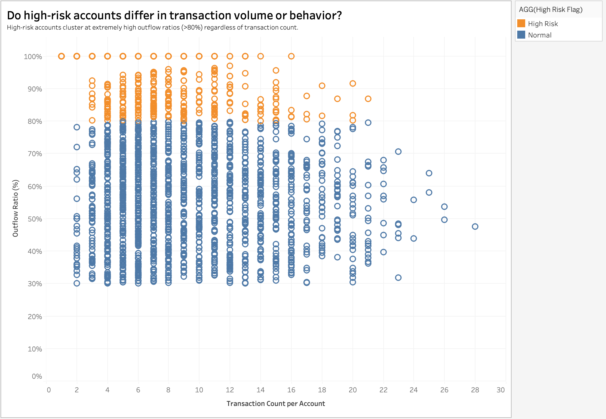
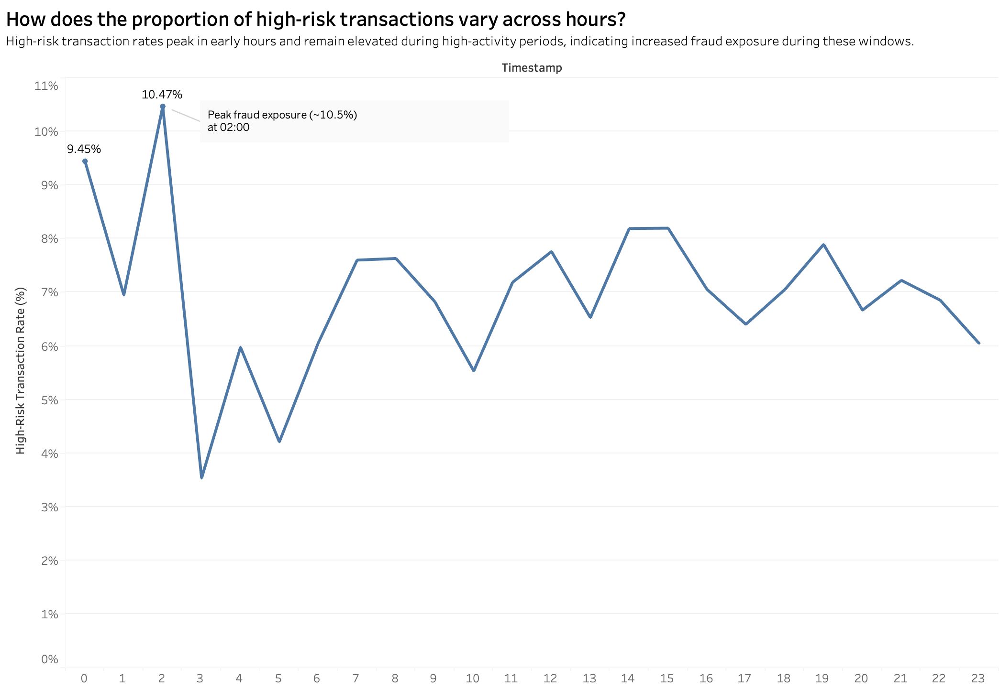
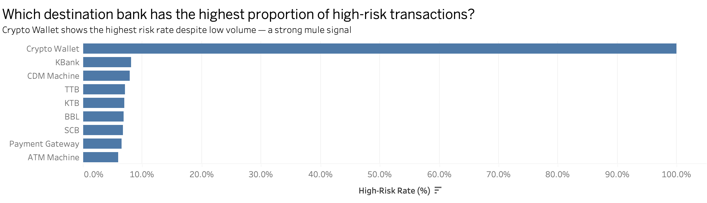
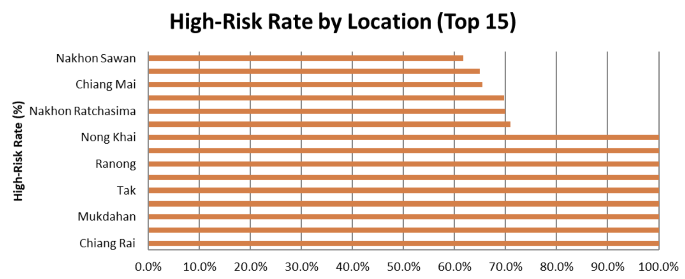

# Detecting scam-Induced transactions to mule Accounts
## Background & Pain Points
- **The Problem**: ปัจจุบันมิจฉาชีพเปลี่ยนรูปแบบจากการเจาะระบบ (Traditional Fraud) มาเป็นการหลอกลวงให้เหยื่อโอนเงินด้วยตนเอง เข้าสู่ "บัญชีม้า"
- **Legacy System Limitations**: ระบบป้องกันภัยแบบเดิมของธนาคารมักตรวจจับจาก "อุปกรณ์ที่ผิดปกติ" หรือ "การเข้าสู่ระบบที่น่าสงสัย" แต่ในกรณี APP Fraud ธุรกรรมเหล่านี้ถูกทำขึ้นโดยตัวลูกค้าเองบนอุปกรณ์เดิมและผ่านการยืนยันตัวตน (เช่น สแกนหน้า/OTP) ทำให้ระบบเดิมไม่สามารถตรวจจับได้
- **Business Impact**: การที่ธนาคารไม่สามารถตรวจจับและระงับเหตุได้ทันท่วงที
  นำไปสู่ความสูญเสียทางการเงินมหาศาลของลูกค้า (Financial Loss)
  ทำลายความน่าเชื่อถือของธนาคาร (Reputational Damage)
  และอาจนำไปสู่การถูกตรวจสอบหรือปรับจากหน่วยงานกำกับดูแล (Compliance Risk)
 ---
## SMART Objectives 
เพิ่มอัตราการตรวจจับทุจริต (Recall) ให้ ≥85% และลดอัตราการแจ้งเตือนผิดพลาด (False Positive Rate) 
ลงโดยอาศัยการวิเคราะห์พฤติกรรมการโอนเงินออกที่ผิดปกติ (Abnormal outflow behavior) 

---
## Questions

- Q1: บัญชีที่มีความเสี่ยงสูง มีสัดส่วนการโอนเงินออก (Outflow Ratio) มากกว่า 80% แตกต่างจากบัญชีปกติอย่างมีนัยสำคัญหรือไม่ และสามารถใช้เป็นตัวบ่งชี้พฤติกรรมบัญชีม้าได้หรือไม่?
- Q2: ธุรกรรมที่เกิดขึ้นในช่วงเวลาสั้นหลังจากได้รับเงิน มีรูปแบบความเร็ว และความถี่แตกต่างจากบัญชีปกติอย่างไร และสะท้อนพฤติกรรมของบัญชีม้าได้หรือไม่?
- Q3: ธุรกรรมจากพื้นที่หรืออุปกรณ์ที่มีความเสี่ยงสูง เพิ่มความน่าจะเป็นของการทุจริตหรือไม่?
---
## Hypothesis
- H1: บัญชีที่มี Outflow Ratio > 80% มีแนวโน้มเป็นบัญชีม้าสูงกว่าบัญชีปกติอย่างมีนัยสำคัญ
- H2: บัญชีม้ามี Transaction Velocity สูง และใช้เวลาโอนออกสั้นมาก (Short Time Delta) ทันทีที่ได้รับเงินเข้า
- H3: การทำธุรกรรมจากอุปกรณ์หรือพื้นที่เสี่ยงสูง (High-risk location) มีความเชื่อมโยงกับ Outflow Ratio ที่สูง และเพิ่มโอกาสเกิด Fraud อย่างชัดเจน
---
## Data Dictionary
This dataset was generated using a structured prompt to simulate realistic Thai banking behavior for early detection of scam-induced transactions.
- Cleaned synthetic dataset (no missing or inconsistent data)
- Designed for behavioral analysis and fraud detection
- Supports BI tools such as Tableau
- Over 20,000 transaction records
- Proper relational integrity across all tables
### Dataset Structure
***Transactions Table***
| Attributes | Data Type | Description | Example |
|-------------|-----------|-------------|-------------|
| transaction_id | VARCHAR(20) | Unique identifier for each transaction |TXN00000001, TXN00000002|
| timestamp | DATETIME | Date and time when the transaction occurred | 1/1/2025 8:07 |
| account_id | VARCHAR(20) | Account ID of the customer who initiated the transaction | ACC-8184053697 |
| device_id | VARCHAR(20) | ID of the device used to perform the transaction | DEV-64cfd9b9 |
| transaction_type | VARCHAR(20) | Type of the transaction |Payment, Deposit, Transfer In, Transfer Out, Withdraw|
| amount | DECIMAL(15,2) | Transaction amount in Thai Baht |2426.42, 12000|
| balance_after | DECIMAL(15,2) | Account balance after the transaction is completed |23615.58, 34593|
| counterparty_bank | VARCHAR(50) |Bank or channel name of the counterparty|SCB, BBL, KTB, Payment Gateway|
| counterparty_account | VARCHAR(50) |Account number or ID of the counterparty|299-2-81028-8, SHOP-6935|
| location_region | VARCHAR(50) |Province where the transaction took place|Phuket, Songkhla|
| risk_level | VARCHAR(20) |Risk level of the transaction assessed by the Fraud Detection system|Normal, Medium, High|
---
***Accounts Table***
| Attributes | Data Type | Description | Example |
|-------------|-----------|-------------|-------------|
|account_id  |VARCHAR(20)|Unique identifier for each bank account|ACC-4163119785, ACC-2801823908|
| customer_id |VARCHAR(10)|ID of the customer who owns the account|CUS00001, CUS00004|
| account_type |VARCHAR(20)|Type of the bank account|Savings, Current, Fixed Deposit, Payroll|
| account_open_date |DATE|Date when the account was officially opened|28/4/2023, 13/3/2024|
---
***Customers Table***
| Attributes | Data Type | Description | Example |
|-------------|-----------|-------------|-------------|
| customer_id |VARCHAR(10)|Unique identifier for each customer|CUS00001, CUS00002|
| full_name |VARCHAR(100)|Full name of the customer|Allison Hill, Brandon Davis|
| age |INT|Age of the customer in years|25, 46, 60|
| occupation |VARCHAR(50)|Customer's current occupation|Engineer, Manager, Freelance, Student|
| estimated_income |DECIMAL(12,2)|Customer's estimated monthly income in Thai Baht|56000, 84000, 126000|
| home_province |VARCHAR(50)|Province of the customer's home address|Bangkok, Phuket, Songkhla|
---
***Devices  Table***
| Attributes | Data Type | Description | Example |
|-------------|-----------|-------------|-------------|
| device_id |VARCHAR(20)|Unique identifier for each registered device|DEV-1a3d1fa7, DEV-17fc695a|
| customer_id |VARCHAR(10)|ID of the customer who owns the device|CUS00001, CUS00002|
| device_model|VARCHAR(50)|Model name of the registered device|Samsung S24, iPhone 14|
| os_version |VARCHAR(20)|Operating system of the device|Android, iOS|
| is_rooted |BOOLEAN|Indicates whether the device has been rooted or jailbroken|TRUE, FALSE|
---
## Data Quality & Cleaning
- **Data Integrity & Quality Check**: ตรวจสอบความครบถ้วนของข้อมูล (Missing Values) 
และกำจัดข้อมูลซ้ำซ้อนโดยใช้ transaction_id เป็น Unique Identifier 
เพื่อป้องกันความคลาดเคลื่อนในการวิเคราะห์เชิงสถิติ
- **Structural & Logical Correction**: ระบุและแก้ไขข้อมูลที่ผิดตรรกะทางธุรกิจ เช่น ยอดเงินติดลบ หรือรูปแบบวันเวลา (Timestamp)
ที่ไม่อยู่ในขอบเขตการวิเคราะห์ เพื่อคงความถูกต้องของโครงสร้างข้อมูล (Data Integrity)
- **Standardization & Consistency**: ปรับมาตรฐานรูปแบบตัวแปร (เช่น ชื่อธนาคาร, ประเภทธุรกรรม)
ให้เป็นรูปแบบเดียวกันทั้งชุดข้อมูล และกำหนด Data Type ให้ถูกต้อง (Datetime, Numeric) เพื่อความพร้อมในการประมวลผล
- **Strategic Outlier & Signal Preservation**: "ไม่ลบค่า Outliers ทิ้ง เนื่องจากค่าที่สูงผิดปกติ (เช่น การโอนเงินถี่หรือยอดสูง)
คือ สัญญาณหลัก (Fraud Signals) ที่ใช้บ่งชี้พฤติกรรมบัญชีม้า โดยมุ่งเน้นการขจัด Noise แต่ยังคงรักษาพฤติกรรมสำคัญของธุรกรรมทุจริตไว้ครบถ้วน

---
## Exploratory Data Analysis

**Key Insight**
- บัญชีที่มีความเสี่ยงสูงกระจุกตัวที่ Outflow Ratio 80–100%
- ปริมาณธุรกรรม (Transaction Volume) ไม่สามารถแยก fraud ได้ชัดเจน
- รูปแบบพฤติกรรมการโอนเงิน เป็นตัวบ่งชี้สำคัญมากกว่าปริมาณ
**Interpretation**
- บัญชีที่มีความเสี่ยงสูงมักมีพฤติกรรม รับเงินแล้วโอนออกทันที (Rapid Drain)
- พฤติกรรมผิดปกติเกิดจาก รูปแบบการไหลของเงิน (Money Flow Pattern) ไม่ใช่จำนวนธุรกรรม
- สะท้อนลักษณะของ บัญชีม้า (Mule Accounts) ที่เคลื่อนย้ายเงินอย่างรวดเร็ว
**Business Value**
- ช่วยตรวจจับ fraud ได้ แม้ไม่ได้มีปริมาณธุรกรรมสูง
- สนับสนุนการพัฒนา behavior-based detection
---

**Key Insight**
- ธุรกรรมในช่วงเวลา 02:00 น. มีสัดส่วน High-Risk สูงสุด (~10.5%)
**Interpretation**
- พฤติกรรมทุจริตเกิดทั้งในช่วงเวลาที่คนใช้งานน้อย 
- แสดงให้เห็นว่า ธุรกรรมที่มีความเสี่ยงสามารถแฝงอยู่ในพฤติกรรมปกติได้
- ชี้ให้เห็นถึง ความสัมพันธ์ระหว่างช่วงเวลาและโอกาสเกิดการทุจริต
**Business Value**
- สามารถใช้กำหนด ช่วงเวลาที่ต้องเฝ้าระวัง (High-Risk Hours)
- เพิ่มประสิทธิภาพในการ ตรวจจับ fraud แบบเชิงเวลา (time-based monitoring)
- ช่วยจัดสรรทรัพยากรในการป้องกัน fraud ได้เหมาะสมยิ่งขึ้น
---

**Key Insight**
- Crypto Wallet มีสัดส่วนธุรกรรมความเสี่ยงสูงสุด (~100%)
- ช่องทางอื่นมีความเสี่ยงต่ำกว่าชัดเจน
**Interpretation**
- บ่งชี้พฤติกรรมบัญชีม้า / การฟอกเงิน
- ความเสี่ยงกระจุกตัวในบางปลายทาง
- Imbalance Handling
- ใช้ % แทนจำนวน
- ลด bias จากข้อมูลที่ไม่สมดุล
**Business Value**
- โฟกัสตรวจสอบช่องทางเสี่ยงสูง
- เพิ่มประสิทธิภาพการตรวจจับ fraud
---

**Key Insight**
- หลายพื้นที่มี High-Risk Rate สูงถึง 100% เช่น Chiang Rai, Mukdahan, Tak
- จังหวัดหลักอย่าง Nakhon Ratchasima และ Chiang Mai ก็มีความเสี่ยงสูง (>60%)
- สะท้อนว่า ความเสี่ยงไม่ได้กระจาย แต่กระจุกตัวในบางพื้นที่
**Interpretation**
- ธุรกรรมในบางพื้นที่มี แนวโน้มเป็น fraud สูงกว่าปกติอย่างชัดเจน
- บ่งชี้ถึง ความสัมพันธ์ระหว่างพื้นที่กับโอกาสเกิดการทุจริต
- อาจสะท้อนถึง เครือข่ายบัญชีม้าในบางพื้นที่
**Business Value**
- ใช้กำหนด พื้นที่เฝ้าระวัง (High-Risk Locations)
- เพิ่มประสิทธิภาพในการ ตรวจจับ fraud เชิงพื้นที่ (location-based monitoring)
---
## Findings and Insights
1. Money Flow Anomaly (พฤติกรรมการไหลของเงิน)
- Account Draining Effect: บัญชี High-risk มี Outflow Ratio สูง (80–100%) สะท้อนพฤติกรรม “รับแล้วโอนออกหมด”
- Low Volume, High Impact: ไม่จำเป็นต้องทำธุรกรรมบ่อย แต่มีสัดส่วนการโอนออกสูง → แยก fraud ได้ดีกว่าการดู Volume
2. Temporal & Channel Patterns (เวลาและช่องทาง)
- High-Risk Time: ความเสี่ยงสูงสุดช่วง ตี 2 และยังคงสูงในช่วงนอกเวลาปกติ
- High-Risk Channels: กระจุกในช่องทางที่โอนเร็วและติดตามยาก เช่น Crypto Wallet, CDM, Payment Gateway
3. Geographic Concentration (พื้นที่)
- Fraud Clustering: ธุรกรรมเสี่ยงกระจุกในบางพื้นที่ โดยเฉพาะ จังหวัดชายแดน/พื้นที่ที่มีสแกมสูง
- บางพื้นที่มี High-Risk Rate สูงมาก (ใกล้ 100%) สะท้อนแหล่งปฏิบัติการหรือเครือข่ายมิจฉาชีพ
---
## Recommendations
** Real-time Rule-based Alerting** : ตั้งค่าตรวจจับธุรกรรมผิดปกติ (เช่น Outflow >80%,ยอดเงินคงเหลือต่ำ และการทำธุรกรรมกลางคืน) และใช้ "Step-up Authentication" (แจ้งเตือนให้ยืนยันตัวตน) เพื่อป้องกันเงินออกแทนการล็อคบัญชีทันที

**Risk-based Account Limits**: กำหนดวงเงินโอนเริ่มต้นสำหรับ "บัญชีเปิดใหม่" ให้ต่ำกว่าปกติจนกว่าจะผ่านเกณฑ์ความน่าเชื่อถือ เพื่อลดความเสี่ยงจากบัญชีม้าใช้แล้วทิ้ง

**High-Risk Destination Monitoring**: เพิ่มการตรวจสอบเข้มงวดและแจ้งเตือนสำหรับปลายทางที่มีความเสี่ยงสูง 

---
## Expected Impacts

**Business Outcome**: ลดความสูญเสียทางการเงิน และเพิ่มความน่าเชื่อถือของธนาคารผ่านกระบวนการป้องกันเชิงรุก (Proactive Prevention)

**Operational**: ลดภาระงานตรวจสอบของเจ้าหน้าที่ธนาคารด้วยระบบกรองอัตโนมัติ (Rule-based)
Customer Experience: เพิ่มความปลอดภัยสูงสุดโดยที่ลูกค้าปกติยังใช้งานได้ราบรื่น (Minimal Disruption)

---
